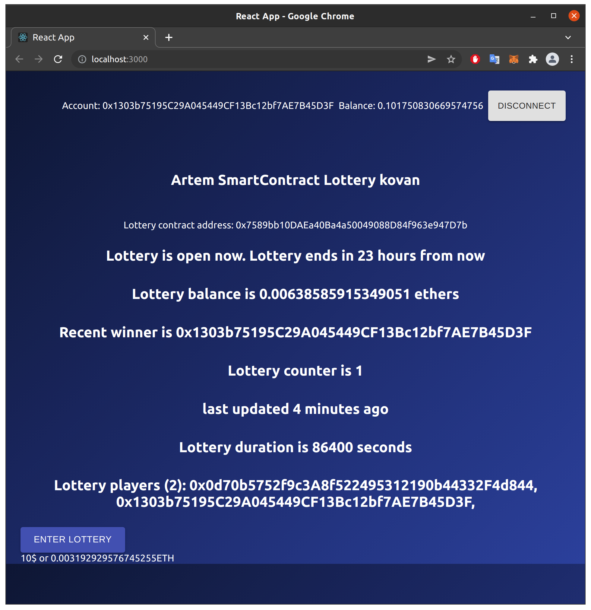

# Smart contract lottery
<br/>
<p align="center">

</a>
</p>
<br/>

## Summary 
This repo is a decentralized lottery project based on Solidity smart contract and front-end for user interaction.
Lottery is started and ended automatically, default lottery duration is 24 hours.
User is allowed to participate the lottery with entry fee (10$ worth of eth).
When lottery is ended random winner is selected. The winner takes the entire pot.

To enter lottery user needs to connect MetaMask account.

Chainlink price feed for calculating entrance fee in eth.
Chainlink keeper is used to schedule end lottery.
Chainlink VRF is used to calculate the winner based on random number.

Lottery contract should be funded with LINK token to work with Chainlink VRF.
Lottery contract should be registered on https://keepers.chain.link/ and funded with LINK token for keeper to work properly.

Only Kovan test network is supported now.

## Prerequisites

Please install or have installed the following:

- [nodejs and npm](https://nodejs.org/en/download/)
- [python](https://www.python.org/downloads/)
## Installation

1. [Install Brownie](https://eth-brownie.readthedocs.io/en/stable/install.html), if you haven't already. Here is a simple way to install brownie.

```bash
pip install --user pipx
pipx ensurepath
# restart your terminal
pipx install eth-brownie
```
Or if you can't get `pipx` to work, via pip (it's recommended to use pipx)
```bash
pip install eth-brownie
```

2. Clone this repo
```
git clone https://github.com/PatrickAlphaC/defi-stake-yield-brownie
cd defi-stake-yield-brownie
```

1. [Install ganache-cli](https://www.npmjs.com/package/ganache-cli)

```bash
npm install -g ganache-cli
```

If you want to be able to deploy to testnets, do the following. 

4. Set your environment variables

Set your `WEB3_INFURA_PROJECT_ID`, and `PRIVATE_KEY` [environment variables](https://www.twilio.com/blog/2017/01/how-to-set-environment-variables.html). 

You can get a `WEB3_INFURA_PROJECT_ID` by getting a free trial of [Infura](https://infura.io/). At the moment, it does need to be infura with brownie. You can find your `PRIVATE_KEY` from your ethereum wallet like [metamask](https://metamask.io/). 

You'll also need testnet rinkeby or Kovan ETH and LINK. You can get LINK and ETH into your wallet by using the [rinkeby faucets located here](https://docs.chain.link/docs/link-token-contracts#rinkeby). If you're new to this, [watch this video.](https://www.youtube.com/watch?v=P7FX_1PePX0)

You'll also want an [Etherscan API Key](https://etherscan.io/apis) to verify your smart contracts. 

You can add your environment variables to the `.env` file:
```bash
export WEB3_INFURA_PROJECT_ID=<PROJECT_ID>
export PRIVATE_KEY=<PRIVATE_KEY>
export ETHERSCAN_TOKEN=<YOUR_TOKEN>
```
> DO NOT SEND YOUR KEYS TO GITHUB
> If you do that, people can steal all your funds. Ideally use an account with no real money in it. 

## Scripts

```bash
brownie run scripts/deploy_lottery.py
```
This will deploy the contracts, depoly some mock Chainlink contracts for you to interact with and update the frontend with smart contract data using your local network.
```bash
brownie run scripts/deploy_lottery.py --network kovan
```
This will do the same thing... but on Kovan. Every command listed below should be executed on the same network where lottery was deployed.
```bash
brownie run scripts/start_lottery.py
brownie run scripts/fund_lottery.py
brownie run scripts/end_lottery.py
```
Helpful scripts to manually interract with lottery. Can be only executed by lottery owner.
```bash
brownie run scripts/enter_lottery.py
brownie run scripts/fund_lottery.py
brownie run scripts/end_lottery.py
brownie run scripts/get_lottery_status.py
brownie run scripts/check_upkeep_lottery.py
```
Helpful scripts to manually interract with lottery. Can be executed by anyone.

## Front end
```bash
cd front_end
yarn
yarn start
```
and you'll be able to interact with the UI

## Testing

```
brownie test
```

# License

This project is licensed under the [MIT license](LICENSE).
